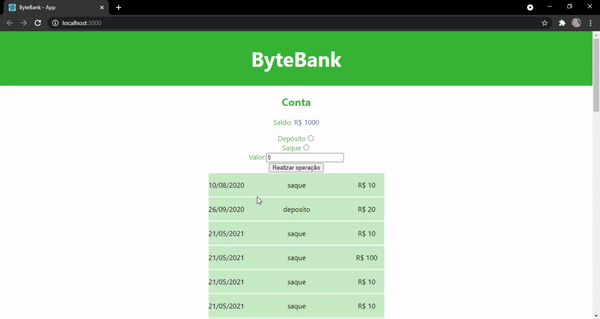
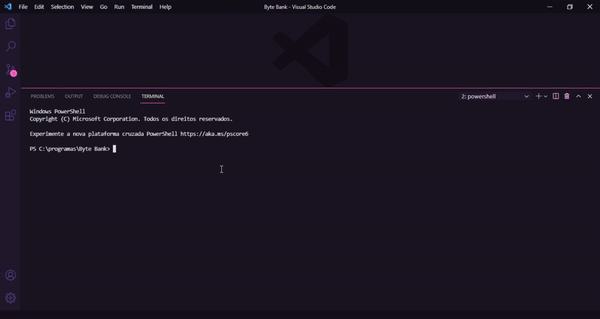

# Byte Bank

Project created in one of Alura's React courses to learn about test automation in front-end applications. <br />

In it I learned: <br />

- How to guarantee the functionality of the application through automated tests;
- How to make descriptive and consistent tests;
- What needs to be tested and what doesn't.

# Overview




# How to run

```
# Clone this repository
$ git clone https://github.com/velleeda/Byte-Bank

# Go to the directory
$ cd Byte Bank
```
  
```
# Install Dependencies
$ npm install

# Run Web Server
$ npm start

# Run Server
$ npm run server

# Run Tests
$ npm test
```

After typing npm test, wait a moment and press "a" to run all tests.
